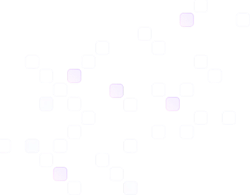

# 🌐 3D Developer Portfolio

A highly interactive, immersive developer portfolio built with modern web technologies. This project showcases MERN stack expertise through a 3D ocean environment, responsive UI, and smooth GSAP animations.

 
*(Note: Preview image varies based on local assets)*

## ✨ Features

- **🌊 Immersive 3D Experience**: Interactive ocean scene using **Three.js** and **React Three Fiber**.
- **🎨 Glassmorphism UI**: Modern, frosted-glass aesthetics built with **Tailwind CSS**.
- **⚡ High Performance**: Smooth animations powered by **GSAP** and **Framer Motion**.
- **📱 Fully Responsive**: Optimized layouts for Mobile, Tablet, and Desktop using `react-responsive` and fluid Tailwind classes.
- **📩 Functional Contact Form**: Direct email integration via **EmailJS** and **React Hook Form**.
- **📈 Dynamic Counters**: Animated statistics for achievements using **React CountUp**.

## 🛠️ Tech Stack

### Core
- **React 19**: Component-based UI library.
- **Vite**: Next-generation frontend tooling.

### Styling & Animation
- **Tailwind CSS 4**: Utility-first CSS framework.
- **GSAP (GreenSock)**: Professional-grade animation library.
- **Framer Motion**: Motion library for React.

### 3D & Graphics
- **Three.js**: JavaScript 3D library.
- **React Three Fiber (R3F)**: React renderer for Three.js.
- **React Three Drei**: Helpers for R3F.

### Utilities
- **EmailJS**: Client-side email service.
- **React Hook Form**: Performant form validation.
- **Lucide React**: Beautiful, consistent icons.

## 🚀 Getting Started

Follow these steps to set up the project locally.

### Prerequisites

- **Node.js** (v18 or higher recommended)
- **npm** or **yarn**

### Installation

1.  **Clone the repository**:
    ```bash
    git clone https://github.com/yourusername/my-portfolio.git
    cd my-portfolio
    ```

2.  **Install dependencies**:
    ```bash
    npm install
    ```

3.  **Set up Environment Variables**:
    Create a `.env` file in the root directory and add your EmailJS credentials:
    ```env
    VITE_APP_EMAILJS_SERVICE_ID=your_service_id
    VITE_APP_EMAILJS_TEMPLATE_ID=your_template_id
    VITE_APP_EMAILJS_PUBLIC_KEY=your_public_key
    ```

4.  **Run the development server**:
    ```bash
    npm run dev
    ```

5.  Open [http://localhost:5173](http://localhost:5173) in your browser.

## 📂 Project Structure

```
src/
├── components/       # Reusable UI components (Button, AnimatedCounter, etc.)
├── constants/        # Static data (NavLinks, WorkExperience, etc.)
├── context/          # React Context providers
├── sections/         # Page sections (Hero, Navbar, Contact, etc.)
│   └── HeroModel/    # 3D Model components (OceanScene)
├── App.jsx           # Main application entry
├── main.jsx          # DOM rendering
└── index.css         # Global styles & Tailwind imports
```

## 📜 Scripts

- `npm run dev`: Start the development server.
- `npm run build`: Build the project for production.
- `npm run preview`: Preview the production build locally.
- `npm run lint`: Run ESLint to check for code quality.

## 🚀 Deployment (Vercel)

The easiest way to deploy this Vite app is using [Vercel](https://vercel.com).

1.  **Push to GitHub**: Ensure your project is pushed to a GitHub repository.
2.  **Import to Vercel**:
    - Go to Vercel Dashboard > **Add New...** > **Project**.
    - Import your GitHub repository.
3.  **Configure Build Settings**:
    - Framework Preset: **Vite** (Should be detected automatically).
    - Build Command: `npm run build`
    - Output Directory: `dist`
4.  **Environment Variables**:
    - Add the same variables from your `.env` file to the Vercel project settings:
        - `VITE_APP_EMAILJS_SERVICE_ID`
        - `VITE_APP_EMAILJS_TEMPLATE_ID`
        - `VITE_APP_EMAILJS_PUBLIC_KEY`
5.  **Deploy**: Click **Deploy**.

## 🤝 Contributing

Contributions are welcome! Please open an issue or submit a pull request for any improvements or bug fixes.

---

**Built by Hemanth Sai Somaraju**
